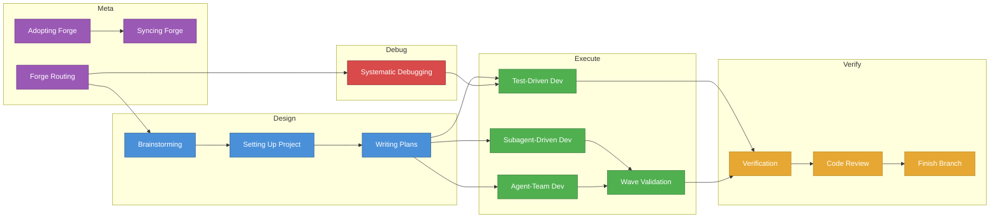

# Forge

Forge is a structured operating mode for AI-assisted software development.
It gives coding agents risk-scaled workflows, evidence-gated completion, and
durable project memory -- so the right amount of ceremony happens for each
task, every claim of completion is backed by evidence, and project context
survives across sessions.

## Why Forge

| Capability | Forge | Superpowers | Spec Kit | Claude Code | Codex | Aider | Cline |
|-----------|:-----:|:-----------:|:--------:|:-----------:|:-----:|:-----:|:-----:|
| Brownfield adoption | Yes | Partial | Partial | No | Partial | Yes | Partial |
| Outcome-first workflows | Yes | Partial | Yes | No | No | No | No |
| Risk-scaled ceremony | Yes | -- | -- | No | No | No | No |
| Evidence-gated completion | Yes | Partial | Partial | No | No | Partial | Partial |
| Multi-agent teams | Yes | -- | -- | Experimental | -- | No | -- |
| TDD enforcement | Yes | Prompt-only | -- | -- | -- | Lint/test | -- |
| Persistent state | Yes | -- | -- | Limited | Limited | -- | Partial |

## Quick Start

1. **Install** -- add Forge to your coding agent ([installation instructions](#installation))
2. **Adopt** -- open your project and say: *"Set up Forge in this project"*
3. **Build** -- say what you want: *"Add a health check endpoint"* -- Forge handles the rest

For day-to-day usage, agent management, audit analysis, and troubleshooting, see the **[Usage Guide](docs/usage-guide.md)**.

## The 8 Workflows

Each workflow maps a developer intent to a pipeline of skills. You just say
what you want -- Forge routes to the right skills automatically.

### Adopt a Repo

> *"Set up Forge in this project"*

| | |
|---|---|
| **What Forge does** | `forge:adopting-forge` --> `forge:syncing-forge` |
| **What you get** | `.forge/` directory with project config, risk policies, platform adapters |
| **Verification** | Adapters generated, project.yaml populated, policies in place |

### Start a Feature

> *"Add a health check endpoint that returns build version and uptime"*

| | |
|---|---|
| **What Forge does** | `forge:brainstorming` --> `forge:setting-up-project` --> `forge:writing-plans` --> execution --> `forge:verification-before-completion` --> `forge:requesting-code-review` --> `forge:finishing-a-development-branch` |
| **What you get** | Tested, reviewed feature on a clean branch ready to merge |
| **Verification** | Tests pass, evidence artifacts collected, code review complete |

### Fix a Bug

> *"Users are getting 500 errors on the /api/orders endpoint"*

| | |
|---|---|
| **What Forge does** | `forge:systematic-debugging` --> (optional planning) --> `forge:test-driven-development` --> `forge:verification-before-completion` |
| **What you get** | Root cause identified, regression test added, fix verified |
| **Verification** | Failing test reproduced the bug, fix makes it pass, no regressions |

### Refactor Safely

> *"Refactor the payment module to use the strategy pattern"*

| | |
|---|---|
| **What Forge does** | `forge:brainstorming` --> `forge:writing-plans` --> `forge:test-driven-development` --> `forge:verification-before-completion` --> `forge:requesting-code-review` |
| **What you get** | Refactored code with identical behavior, full test coverage |
| **Verification** | All existing tests pass, new tests cover refactored paths, review confirms behavioral equivalence |

### Review a Change

> *"Review PR #42"*

| | |
|---|---|
| **What Forge does** | `forge:requesting-code-review` or `forge:receiving-code-review` |
| **What you get** | Structured review with findings categorized by severity |
| **Verification** | Review checklist completed, issues logged, response plan if receiving |

### Resume Work

> *(start a new session)*

| | |
|---|---|
| **What Forge does** | `forge-session-start` hook --> forge-state restoration --> resume at last skill |
| **What you get** | Seamless continuation from where you left off |
| **Verification** | State restored, pending tasks visible, next action clear |

### Prepare a Release

> *"Ship it"*

| | |
|---|---|
| **What Forge does** | `forge:verification-before-completion` --> `forge:finishing-a-development-branch` |
| **What you get** | Verified branch merged or PR created with full evidence trail |
| **Verification** | All evidence gates satisfied, branch clean, CI passing |

### Investigate an Incident

> *"Why is the worker queue backing up?"*

| | |
|---|---|
| **What Forge does** | `forge:systematic-debugging` |
| **What you get** | 4-phase root cause analysis with evidence at each step |
| **Verification** | Hypotheses tested, root cause confirmed with data, fix path identified |

## How It Works

### Skill Flow

Forge ships 22 skills organized into five categories: routing, design,
execution, verification, and meta. Skills compose into pipelines -- the router
selects the right entry point, and each skill hands off to the next based on
workflow phase.



### Risk-Scaled Ceremony

Every change is classified into a risk tier. Higher tiers require more evidence
before completion is allowed.

| Tier | When | What's Required | Example |
|------|------|----------------|---------|
| **minimal** | Low-risk, small changes | Goal + tasks | Fix a typo, update a config |
| **standard** | Normal development | + test expectations + plan approval | Add a new API endpoint |
| **elevated** | Important or cross-cutting | + design doc + wave analysis | Refactor auth system |
| **critical** | High-stakes or irreversible | + risk register + rollback plan + security review | Database migration, payment flow |

Risk tiers are defined in `policies/default.yaml` and matched by file glob
patterns. First matching rule wins.

## Installation

<details>
<summary><strong>Claude Code</strong></summary>

```bash
claude plugin add --url https://github.com/rahulsc/forge
```

</details>

<details>
<summary><strong>Cursor</strong></summary>

In Cursor Agent chat:

```text
/add-plugin forge
```

Or search for "forge" in the plugin marketplace.

</details>

<details>
<summary><strong>Codex</strong></summary>

Tell Codex:

```
Fetch and follow instructions from https://raw.githubusercontent.com/rahulsc/forge/refs/heads/main/.codex/INSTALL.md
```

See [docs/README.codex.md](docs/README.codex.md) for detailed setup.

</details>

<details>
<summary><strong>OpenCode</strong></summary>

Tell OpenCode:

```
Fetch and follow instructions from https://raw.githubusercontent.com/rahulsc/forge/refs/heads/main/.opencode/INSTALL.md
```

See [docs/README.opencode.md](docs/README.opencode.md) for detailed setup.

</details>

<details>
<summary><strong>Gemini CLI</strong></summary>

```bash
gemini extensions install https://github.com/rahulsc/forge
```

To update:

```bash
gemini extensions update forge
```

</details>

## Verify Installation

Start a session and try a prompt that should trigger a skill:

| Platform | Test prompt | Expected behavior |
|----------|-----------|------------------|
| Claude Code | *"Help me plan this feature"* | `forge:brainstorming` activates |
| Cursor | *"Let's debug this issue"* | `forge:systematic-debugging` activates |
| Codex | *"Set up Forge here"* | `forge:adopting-forge` activates |
| OpenCode | *"Add a new endpoint"* | `forge:brainstorming` activates |
| Gemini CLI | *"Review this PR"* | `forge:requesting-code-review` activates |

If skills do not activate, run `forge:diagnosing-forge` to check your setup.

## Getting Started

Here is what your first ten minutes with Forge look like.

**Step 1 -- Install Forge** using the [instructions above](#installation).

**Step 2 -- Open your project.** `cd` into any existing repository.

**Step 3 -- Adopt Forge.**

Say: *"Set up Forge in this project"*

Forge runs `adopting-forge`, which scans your repo, creates `.forge/project.yaml`
with your tech stack and build commands, generates risk policies in
`policies/default.yaml`, and writes platform adapters. You will see a summary
of what was configured.

**Step 4 -- Build something.**

Say: *"Add a health check endpoint that returns build version and uptime"*

Watch the pipeline in action:
- **Brainstorming** -- Forge asks clarifying questions: JSON or plain text?
  Include dependency status? Authentication required?
- **Planning** -- After you approve the design, Forge writes an implementation
  plan with test expectations and task breakdown.
- **Execution** -- Forge classifies the change (likely `standard` tier), writes
  tests first (TDD), implements the endpoint, and collects evidence.
- **Verification** -- Tests pass, evidence recorded, code review checklist
  completed.

**Step 5 -- Observe the system.** Notice that Forge selected the risk tier
automatically, required tests before implementation, and collected evidence at
each stage. For a documentation change it would require almost nothing. For a
database migration it would require a security review and rollback plan.

## Infrastructure

Forge separates product artifacts (shipped with the plugin) from per-project
configuration (created when you adopt Forge in a repository).

### Product artifacts

These live at the top level of the Forge repository:

| Directory | Purpose |
|-----------|---------|
| `bin/` | Runtime tools: `classify-risk`, `forge-evidence`, `forge-memory`, `forge-state`, `forge-pack`, `forge-audit` |
| `policies/` | Risk classification rules (`default.yaml`) |
| `skills/` | The 22 skills that define Forge workflows |
| `agents/` | Specialist agent definitions for multi-agent teams |
| `hooks/` | Session lifecycle hooks (e.g., `forge-session-start`) |
| `workflows/` | Multi-step workflow definitions (declarative YAML) |
| `packs/` | Installed pack bundles |
| `templates/` | Scaffolding templates for new projects |
| `adapters/` | Platform-specific adapter files |

### Per-project configuration

The `.forge/` directory is created when you adopt Forge in a repository. It
contains:

- `project.yaml` -- project name, tech stack, build/test/lint commands, repo
  traits
- `shared/architecture.md` -- project architecture overview, kept current by
  agents
- `shared/conventions.md` -- coding conventions and style decisions
- `shared/decisions/` -- architectural decision records (ADR format)
- `local/` -- machine-local runtime state (gitignored)

## Agent Roster

| Agent | Role | Use Case |
|-------|------|----------|
| **architect** | System design, API design, tech debt | Architecture decisions, cross-service consistency |
| **implementer** | Feature implementation, bug fixes | Writing code following TDD |
| **qa-engineer** | Test design, coverage analysis | Pipelined TDD, test quality |
| **code-reviewer** | Code quality, plan compliance | Post-implementation review |
| **security-reviewer** | Vulnerability assessment, auth review | Critical-tier security audit |
| **forge-author** | Skill and agent definition authoring | Writing and editing Forge skills and agents |
| **frontend-engineer** | Component design, accessibility, UI testing | Frontend tasks, browser compatibility |
| **backend-engineer** | API design, database integration, error handling | Backend tasks, data access, scalability |
| **database-specialist** | Schema design, migration safety, data integrity | Database changes, migration review |
| **devops-engineer** | CI/CD pipelines, container config, secrets management | Deployment, infrastructure review |

These agents are used by `forge:agent-team-driven-development` and
`forge:composing-teams` for parallel wave execution with between-wave
verification gates.

## Extending Forge

### Writing Skills

Use `forge:writing-skills` to create new skills following TDD methodology.
Each skill is a directory under `skills/` containing a `SKILL.md` file and
optional supporting files. Skills are activated by `forge:forge-routing` based
on pattern matching against the user's intent. See
`skills/writing-skills/SKILL.md` for the complete guide.

### Creating Packs

A pack bundles skills, policies, and shared knowledge into a distributable
unit. Use `forge:forge-packs` to create, install, and manage packs. Packs
can be installed from local directories or remote Git repositories. See
`forge-pack-hello-world/` for a working example.

### Adding Agents

Agent definitions live in `agents/` as Markdown files. Define the agent's
role, responsibilities, and behavioral constraints. New agents are
automatically available to `forge:composing-teams` for team assembly in
multi-agent workflows.

## FAQ

**What if a skill does not activate?**
Run `forge:diagnosing-forge` to check your setup. It validates `.forge/`
state, adapter configuration, and hook wiring.

**How do I change the risk tier for a file pattern?**
Edit `policies/default.yaml`. Rules are evaluated top-to-bottom; first match
wins. Add a rule above the catch-all to override the default tier for specific
paths.

**Can I use Forge with a different LLM?**
Yes. Forge is host-agnostic -- it works through the coding agent's plugin or
extension system, not through direct API calls. Any agent that can load Forge
skills can use them.

**How do I skip a workflow step?**
The risk tier determines which steps are required. Lower the tier for your file
patterns in `policies/default.yaml` to reduce required ceremony. For one-off
overrides, tell your agent to use a specific skill directly.

**How do I resume after a crash?**
The session hook restores state automatically on the next session start. Say
*"Where was I?"* and Forge will show your pending tasks and last active skill.

**How do I update Forge?**
Run the update command for your platform (e.g., `/plugin update forge` for
Claude Code, `gemini extensions update forge` for Gemini CLI). Skills update
with the plugin.

## Philosophy

- **Test-Driven Development** -- write tests first, always
- **Evidence over claims** -- verify before declaring success
- **Systematic over ad-hoc** -- process over guessing
- **Complexity reduction** -- the right amount of ceremony, no more

## Attribution

Forge is derived from [Superpowers](https://github.com/obra/superpowers),
originally created by Jesse Vincent. See [ORIGINS.md](ORIGINS.md) for the full
story and [NOTICE.md](NOTICE.md) for formal attribution.

## License

MIT License -- see [LICENSE](LICENSE) file for details.

## Support

- **Issues:** https://github.com/rahulsc/forge/issues
