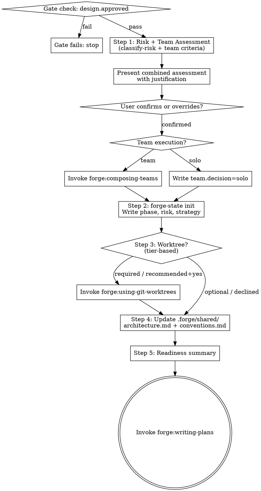

# Setting Up a Project

## Overview

Bridge between an approved design and execution. Classifies risk, evaluates team criteria, initializes state, sets up the workspace — so that `forge:writing-plans` can start from a clean, known configuration.

**Announce at start:** "I'm using the setting-up-project skill to prepare the workspace before writing plans."

<HARD-GATE>
Do NOT invoke `forge:writing-plans` until all five steps in this skill are complete.
</HARD-GATE>


## Verification Gate

Before starting, check the design gate:

```
forge-gate check design.approved --project-dir .
```

If the gate fails (exit code != 0):
- Stop immediately.
- Report: "design.approved gate failed — complete `forge:brainstorming` and get design approval before running setting-up-project."
- Do NOT proceed until the gate passes.


## Step 1 — Risk and Execution Assessment

Classify risk AND evaluate team criteria together. Present the full picture to the user for confirmation.

### 1a. Classify risk

Invoke `classify-risk` to determine the risk tier:

```
classify-risk <files-or-dirs-affected> --scope <task-count>
```

### 1b. Evaluate team criteria

Scan the design doc for task decomposition. Evaluate all three criteria:

| Criterion | Threshold | Met? |
|-----------|-----------|------|
| Task count | 4+ distinct tasks | |
| Independence | 2+ tasks can run in parallel | |
| Specialist domains | 2+ distinct areas of expertise | |

**Compose a team ONLY if ALL three criteria are met.** Otherwise proceed solo.

### 1c. Present combined assessment

Present everything together with justification, then ask for confirmation:

```
Risk and Execution Assessment:

  Files affected:  <list of dirs/files>
  Scope:           <N> tasks
  Risk tier:       <tier> (<reason — e.g., "no critical paths, small scope">)

  Team criteria:
    Task count:       <N> (<threshold met/not met>)
    Independence:     <assessment>
    Specialist domains: <N> — <list> (<threshold met/not met>)

  Execution strategy: <solo|team> (<justification>)

  Worktree: <recommendation based on tier>

Does this assessment look correct, or would you like to override anything?
```

<HARD-GATE>
Do NOT proceed without explicit user confirmation of the risk and execution assessment. The user must agree or override before state is written.
</HARD-GATE>

Accept overrides if provided. Record the source as `override` if changed.

**Tier → worktree mapping:**

| Tier | Worktree |
|------|----------|
| minimal | Not created (work directly on branch) |
| standard | Optional (offer, default to no) |
| elevated | Recommended (offer, default to yes) |
| critical | Required |

### 1d. If team execution

Invoke `forge:composing-teams`. Do not design the roster yourself.

`forge:composing-teams` must:
1. Scan the `agents/` directory to discover available specialist agents
2. Present the available agents to the user with recommended specialist-to-task mapping
3. Recommend model tier per role (opus for architecture/complex, sonnet for implementation, haiku for mechanical)
4. Propose team size based on the design's parallelism
5. Get explicit user approval of the roster

After the user approves, write the roster to state:
```
forge-state set team.roster "<approved roster JSON>" --project-dir .
forge-state set team.decision team --project-dir .
```

<HARD-GATE>
Do NOT proceed to `forge:writing-plans` until `forge:composing-teams` has run and `team.roster` is written to state. The lead must NEVER improvise team structure — the roster comes from composing-teams with user approval.
</HARD-GATE>

### 1e. If solo execution

```
forge-state set team.decision solo --project-dir .
```


## Step 2 — Initialize State

Run `forge-state init` to create the local state store for this project:

```
forge-state init --project-dir .
```

Then write the project phase and risk classification to state:

```
forge-state set phase setting-up --project-dir .
forge-state set risk.tier <tier> --project-dir .
forge-state set risk.source <policy|inferred|override> --project-dir .
forge-state set risk.execution_strategy <strategy> --project-dir .
```

State is stored in `.forge/local/` which is gitignored. It persists across sessions within the same working directory.


## Step 3 — Worktree Setup

Create an isolated worktree based on the risk tier (from Step 1 assessment).

For **Required** tiers (critical): create the worktree now via `forge:using-git-worktrees`. Do not skip.

For **Recommended** tiers (elevated): ask the user:
> "Elevated tier projects benefit from an isolated worktree. Create one now? (Recommended — default yes)"

For **Optional** tiers (standard): ask the user:
> "Standard tier — a worktree is available if you want isolation. Create one? (default: no)"

For **minimal** tiers: Do not create a worktree. Work directly on the current branch.

After worktree creation, `forge:using-git-worktrees` writes `worktree.main.path` to state. Verify the path is accessible before continuing.


## Step 4 — Update Shared Docs

Update the shared documentation that downstream agents and implementers will reference.

Ensure these files exist in `.forge/shared/`:

**`.forge/shared/architecture.md`** — high-level system structure from the design:
- Project name and goal (one sentence)
- Key components and their responsibilities
- External dependencies
- Public interfaces that implementers must not break

**`.forge/shared/conventions.md`** — coding and workflow standards:
- Language/stack in use
- File naming and directory conventions
- Testing approach (TDD, pipelined TDD, etc.)
- Commit message format
- Any project-specific rules from `CLAUDE.md`

If these files already exist (re-run or re-adoption), update them in place. Do not lose existing content without reading it first.


## Step 5 — Readiness Summary

Present a summary before handing off to writing-plans:

```
Project setup complete:

  Risk tier:  <tier>  (<source>)
  Worktree:   <path | not created>
  Team:       <solo | team — N agents>
  Phase:      setting-up → planning (next)

Shared docs updated:
  .forge/shared/architecture.md
  .forge/shared/conventions.md

Ready to write implementation plans.
```

Ask: "Shall I proceed to `forge:writing-plans`?"

On user confirmation, invoke `forge:writing-plans`.


## Process Flow




## State Written by This Skill

```yaml
phase: setting-up
risk:
  tier: <minimal|standard|elevated|critical>
  source: <policy|inferred|override>
  execution_strategy: <solo|team-optional|team-recommended|team-required>
worktree:
  main:
    path: <path>          # written by forge:using-git-worktrees
team:
  decision: <solo|team>
  roster: <JSON>            # written by forge:composing-teams (team only)
```

All state is stored in `.forge/local/` (gitignored).


## Integration

**Before this skill:**
- `forge:brainstorming` — design doc written, `design.approved: true` in state

**After this skill:**
- `forge:writing-plans` — receives initialized state with risk tier, worktree path, and team decision

**Delegates to:**
- `classify-risk` — risk tier determination (do not re-implement)
- `forge:using-git-worktrees` — worktree creation (do not re-implement)
- `forge:composing-teams` — team roster (do not re-implement)

**Reads from state:** `design.approved`
**Writes to state:** `phase`, `risk.tier`, `risk.source`, `risk.execution_strategy`, `team.decision`
